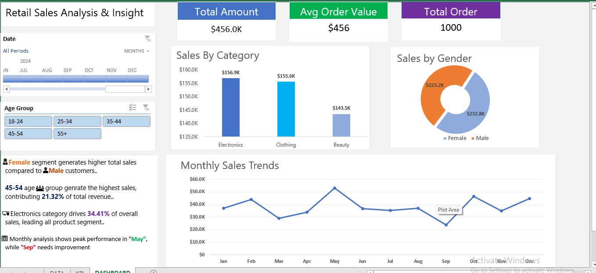

# Retail-Sales-Analysis-Dashboard--Excel-
# 📊 Retail Sales Analysis Dashboard (Excel)

## 📌 Project Overview

This project is an interactive **Retail Sales Dashboard** built using Microsoft Excel.
It provides a clear and concise analysis of sales performance across different dimensions such as **category, gender, age group, and monthly trends**.

The dashboard helps in identifying key business insights and supports data-driven decision-making.

---

## 🎯 Objectives

* Analyze overall sales performance
* Identify top-performing product categories
* Understand customer behavior (gender & age group)
* Track monthly sales trends
* Present insights in a visually appealing dashboard

---

## 📷 Dashboard Preview

---

## 📊 Key Metrics

* **Total Sales:** $456K
* **Average Order Value:** $456
* **Total Orders:** 1000

---

## 📈 Key Insights

* 👩 **Female customers** generate higher sales compared to male customers
* 👥 **Age group 45–54** contributes the highest revenue (~21.32%)
* 📦 **Electronics category** leads with ~34.41% of total sales
* 📅 **May** shows peak sales performance
* ⚠️ **September** shows lower performance and needs improvement

---

## 🛠️ Tools & Features Used

* Microsoft Excel
* Pivot Tables
* Pivot Charts
* Slicers (for interactivity)
* Data Cleaning Techniques
* KPI Cards (Total Sales, AOV, Orders)

---

## 📂 Dataset Details

The dataset includes the following fields:

* Order Date
* Product
* Category
* Customer Name
* Gender
* Age Group
* Region
* Price
* Quantity

---

## 🚀 How to Use

1. Download the Excel file from this repository
2. Open in Microsoft Excel (2016 or later recommended)
3. Use slicers (Date, Age Group) to filter data
4. Explore insights through interactive visuals

---

## 💡 Skills Demonstrated

* Data Analysis
* Data Cleaning
* Business Insight Generation
* Dashboard Design
* Excel Visualization Techniques

---

## 📌 Future Improvements

* Add Profit & Cost analysis
* Include region-wise sales map
* Build the same dashboard in Power BI
* Automate data updates using Power Query

---

## 🙋‍♂️ About Me

I am a fresher learning **Data Analysis (Excel, SQL, Power BI)** and building real-world projects to improve my skills.

---

## ⭐ If you found this project useful, please give it a star!

